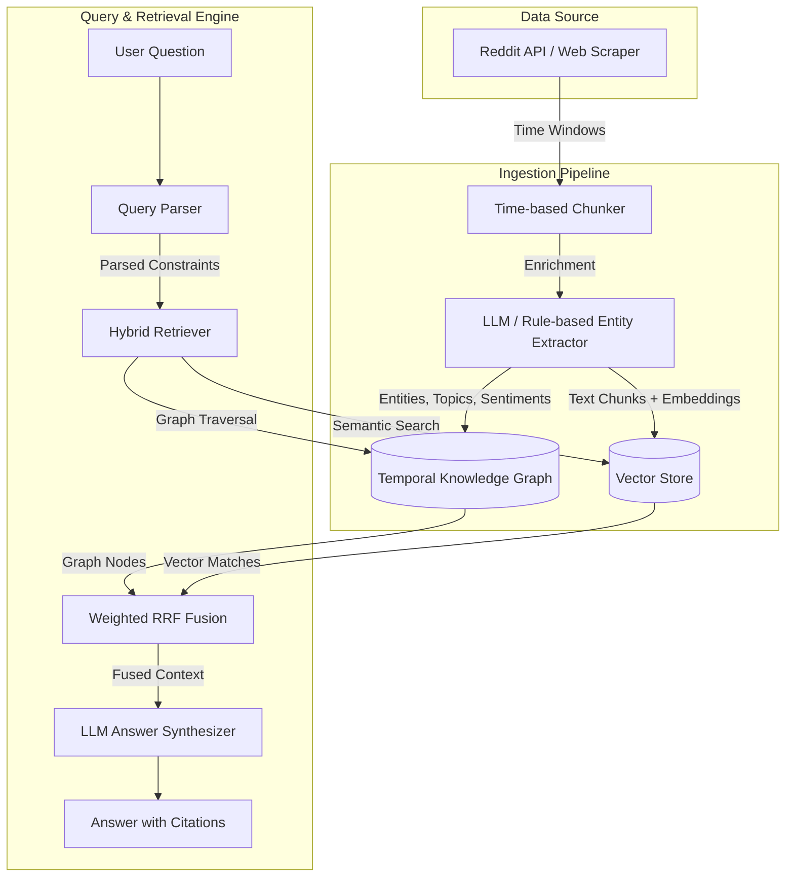

# GraphRAG for Time-Series Reddit Intelligence

An enterprise-grade hybrid retrieval-augmented generation (RAG) system that structures real-world time-series opinion data from Reddit into a temporal knowledge graph and vector index. Built for analyst queries spanning time, influence, and semantics.

---

## 📐 Architecture Overview

Here is a visual flow of the system architecture from data collection to LLM generation:



### Ingestion Pipeline
1. **Scraping**: Ingests Reddit discussions across configurable time windows (e.g., Q3 2025, Q4 2025, Q1 2026) using Reddit API or fallback web scrapers.
2. **Entity & Relation Extraction**: Uses LLMs (Gemini, OpenAI, Groq) or a rule-based fallback to extract key entities, topics, relationships, and sentiments.
3. **Dual Storage**:
   - **Graph Store**: Encodes users, posts, comments, topics, and their connections (e.g. `POSTED_BY`, `MENTIONS`, `REPLIED_TO`) with temporal properties.
   - **Vector Store**: Indexes chunked post and comment text using semantic embeddings.

### Query Engine
1. **Query Parsing**: Parses incoming questions to identify the query type (`semantic`, `graph`, `hybrid`, `temporal`), target entities, and time constraints.
2. **Hybrid Retrieval**: Queries both stores:
   - **Graph Retrieval**: Traverses relationships around matching entities.
   - **Vector Retrieval**: Performs similarity search on text embeddings.
3. **RRF Fusion**: Combines and re-ranks retrieval sets using Weighted Reciprocal Rank Fusion (RRF).
4. **Answer Synthesis**: Renders the fused context into a structured answer citing exact posts, authors, subreddits, and timestamps.

---

## 🛠️ Tech Stack & Rationale

| Component | Technology | Rationale |
|---|---|---|
| **Language** | Python 3.11+ | Industry standard for AI/LLM engineering with excellent ecosystem support. |
| **LLM Orchestration** | `google-genai` / `openai` / `groq` | Native integrations allow high-quality extraction and synthesis across premium providers with a fast, zero-dependency local fallback. |
| **Vector DB** | ChromaDB / In-Memory | ChromaDB offers easy local persistence, whereas the In-Memory store allows instant zero-config runs. |
| **Graph DB** | Neo4j / NetworkX | Neo4j provides enterprise-grade Cypher querying for complex traversals; NetworkX provides a lightweight, zero-dependency in-memory graph store. |
| **Scraping** | PRAW / `duckduckgo_search` / Firecrawl | Reddit's API limits are bypassed cleanly via a robust multi-backend search-and-scrape pipeline. |
| **Reranking** | Reciprocal Rank Fusion (RRF) | Avoids model-based cross-encoder latency and merges sparse graph relations and dense vector embeddings into a single ranked list. |

---

## ⚡ Setup & Quick Start (< 5 mins)

The project includes a zero-config mode that runs out of the box with no external credentials, using pre-built sample datasets and in-memory stores.

```bash
# 1. Clone & Navigate
git clone https://github.com/Shyam2119/GraphRag_AI.git
cd GraphRAG_assignment

# 2. Virtual Environment Setup
python -m venv venv
# On Windows PowerShell:
.\venv\Scripts\Activate.ps1
# On macOS/Linux:
source venv/bin/activate

# 3. Install Dependencies
pip install -r requirements.txt

# 4. Run the Demo
python demo.py
```

---

## 🚀 Custom Configurations & Live Data

To unlock the full potential of GraphRAG using real LLMs, external databases, or live scraping:

1. Create a local environment file:
   ```bash
   cp .env.example .env
   ```
2. Configure your API keys and databases:
   - **LLM**: Set `GEMINI_API_KEY`, `OPENAI_API_KEY`, or `GROQ_API_KEY`.
   - **Live Scraping**: Set `REDDIT_CLIENT_ID` and `REDDIT_CLIENT_SECRET` (or `SCRAPE_METHOD=web` for web scraper).
   - **Production DBs**: Set `NEO4J_URI` and `USE_CHROMA=true`.

For detailed scenario setups, see [SETUP.md](file:///d:/Shyam/GraphRAG_assignment/SETUP.md).

---

## 🔍 Demo Query Set & Outputs

The demo executes 4 query classes mapping different retrieval strengths:
1. **Semantic (Vector-dominant)**: "What are the main challenges people face when building RAG pipelines?"
2. **Graph Traversal (Graph-dominant)**: "Who are the most influential voices in discussions about AI regulation, and what are they saying?"
3. **Hybrid**: "Which communities are leading the conversation on open-source LLMs, and what priorities distinguish them?"
4. **Temporal Comparison**: "What emerging concerns about AI safety appeared in Q1 2026 that weren't discussed in Q4 2025?"

Outputs and exact retrieval scores are saved dynamically to `demo_results.json` after running the demo.

---

## 🧪 Validation & Testing

Run sanity checks and test coverage to verify setup integrity:
```bash
# Run validation check
python validate.py

# Run all test suites
python -m pytest
```
