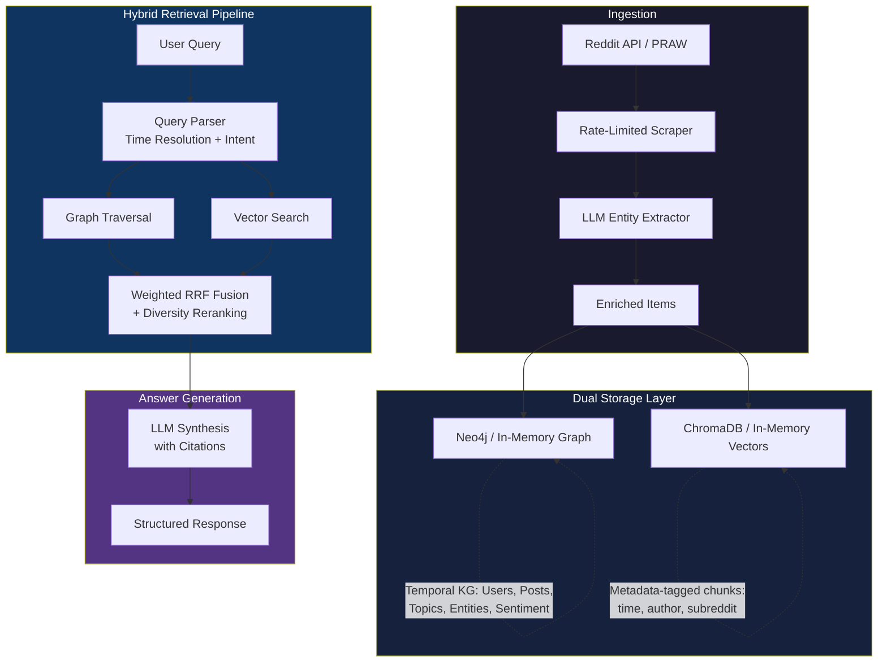
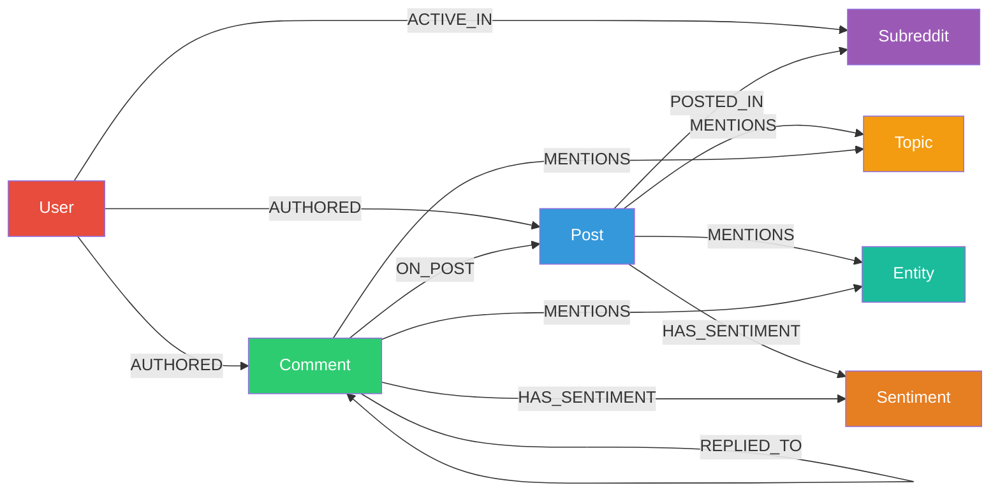

# 🔱 GraphRAG for Time-Series Reddit Intelligence

[](https://www.python.org/downloads/)
[](LICENSE)

> **Hybrid retrieval system** that ingests Reddit posts and comments across multiple time windows, structures them as a **temporal knowledge graph** and **vector index**, and answers questions using **fused graph + semantic retrieval** with LLM-powered synthesis.

Built for the **Jupiter Meta Labs GenAI Engineer Assignment** — demonstrating how graph traversal and vector search complement each other for complex, time-aware intelligence queries.

---

## 🏗 Architecture



### Data Flow

1. **Ingestion** — Scrape Reddit posts/comments across 3 time windows (Q3 2025, Q4 2025, Q1 2026) with rate limiting and pagination
2. **Enrichment** — LLM extracts entities, topics, and sentiment from each item (with keyword fallback when no API key)
3. **Graph Store** — Temporal knowledge graph stores Users, Posts, Comments, Subreddits, Topics, Entities with timestamped relationships
4. **Vector Store** — Chunked content indexed with metadata (time, subreddit, author, sentiment) for filtered semantic search
5. **Retrieval** — Queries trigger both graph traversal and vector search, fused via **weighted Reciprocal Rank Fusion** with diversity reranking
6. **Answer** — LLM synthesizes fused results into a cited answer, structured by query type

### Knowledge Graph Schema



Every node and relationship carries `created_at` for temporal filtering. Relationships include confidence scores and sentiment labels.

---

## ⚡ Tech Stack & Reasoning

| Component | Choice | Why |
|-----------|--------|-----|
| **Language** | Python 3.10+ | Assignment requirement |
| **Reddit API** | PRAW | Official wrapper with built-in rate limiting, pagination, and OAuth |
| **Graph DB** | Neo4j (+ NetworkX fallback) | Native graph traversals for influence chains, community leadership, entity co-occurrence. Cypher queries express graph patterns naturally. In-memory fallback ensures demos work without Docker |
| **Vector DB** | ChromaDB (+ in-memory fallback) | Embedded persistence, rich metadata filtering for temporal/subreddit/author constraints, cosine similarity out of the box |
| **Embeddings** | Gemini → Sentence-Transformers → ONNX → Hash | Cascading fallback: best available quality without hard dependencies. Sentence-Transformers (all-MiniLM-L6-v2) gives excellent quality locally |
| **LLM** | Gemini 2.0 Flash / OpenAI / Groq / Ollama | Entity extraction, query parsing, answer generation. **4 providers** supported — Groq offers free-tier access |
| **Fusion** | Weighted Reciprocal Rank Fusion (k=60) | Query-type-aware weights: semantic queries favor vector (2.5:1), graph queries favor graph (2.5:1). Diversity reranking (MMR-style) prevents result homogeneity |

### Why These Choices?

**Neo4j over alternatives:** Reddit data is inherently relational — users author posts in subreddits, posts mention entities, comments reply to other comments. Graph traversal lets us answer "who are the most influential voices?" by following `AUTHORED → MENTIONS → entity` chains with aggregation — something vector similarity search cannot express.

**Weighted RRF over score normalization:** Raw scores from graph (mention_count × post_score) and vector (cosine similarity) are on different scales. RRF is rank-based, avoiding normalization issues. We add query-type-aware weights so semantic queries lean on vector results and structural queries lean on graph traversal.

**Temporal properties on everything:** Every node and relationship has `created_at`. This enables time-windowed queries at the database level (not post-filtering), which is essential for "what changed between Q4 2025 and Q1 2026?" queries.

**Graceful degradation:** The system runs without any API keys or external services by falling back to: sample data -> keyword extraction -> hash embeddings -> in-memory stores -> rule-based answers. The default reviewer path is therefore `clone -> pip install -> python demo.py`.

---

## 🚀 Quick Start (< 10 minutes)

**For detailed setup instructions, see [SETUP.md](SETUP.md) with 4 configuration options.**

**No Reddit API? No problem!** See [WEB_SCRAPING_ALTERNATIVES.md](WEB_SCRAPING_ALTERNATIVES.md) for web scraping without API credentials.

### Fastest Path (Reviewer-Safe Default)

```bash
# 1. Clone and setup
git clone <repo-url>
cd GraphRAG_assignment
python -m venv venv
source venv/bin/activate  # or: .\venv\Scripts\activate on Windows
pip install -r requirements.txt

# 2. Run the full demo
python demo.py

# 3. Optional: create .env only if you want live data or provider overrides
copy .env.example .env   # Windows
# cp .env.example .env   # macOS/Linux
```

By default the demo uses sample data, the in-memory graph store, local/fallback embeddings, and rule-based answer synthesis whenever no provider is configured or a provider call fails. The structured output is written to `demo_results.json`.

---

## 📁 Project Structure

```
├── demo.py                      # Demo script (4 query types + CLI)
├── config.py                    # Settings from .env
├── docker-compose.yml           # Neo4j container
├── requirements.txt
├── .env.example                 # All config keys documented
├── tests/
│   ├── test_fusion.py           # RRF fusion & diversity tests
│   ├── test_query_parser.py     # Time resolution & intent tests
│   └── test_chunker.py          # Chunking & metadata tests
└── src/
    ├── models.py                # Shared data models (Pydantic/dataclass)
    ├── ingestion/
    │   ├── reddit_scraper.py    # PRAW scraping with time windows
    │   ├── llm_extractor.py     # Entity/topic/sentiment extraction
    │   └── sample_data.py       # 40+ realistic demo data templates
    ├── graph/
    │   ├── factory.py           # Neo4j → NetworkX fallback
    │   ├── neo4j_store.py       # Temporal knowledge graph (6 query types)
    │   └── networkx_store.py    # In-memory graph fallback
    ├── vector/
    │   ├── factory.py           # ChromaDB → in-memory fallback
    │   ├── chroma_store.py      # Metadata-filtered vector search
    │   ├── memory_store.py      # In-memory vector fallback
    │   ├── embeddings.py        # 4-tier embedding cascade
    │   └── chunker.py           # Text chunking with metadata
    ├── retrieval/
    │   ├── hybrid_pipeline.py   # Graph + vector orchestration
    │   └── fusion.py            # Weighted RRF + diversity reranking
    ├── llm/
    │   ├── client.py            # Multi-provider LLM client (4 providers)
    │   └── query_parser.py      # Query understanding + time resolution
    └── pipeline/
        ├── ingest.py            # End-to-end ingestion
        └── query.py             # Query → retrieve → answer
```

---

## 🎯 Demo Queries

| # | Type | Query | What It Tests |
|---|------|-------|---------------|
| 1 | **Semantic** | "What are the main challenges people face when building RAG pipelines?" | Vector search finds relevant content by meaning |
| 2 | **Graph** | "Who are the most influential voices in discussions about AI regulation, and what are they saying?" | Graph traversal surfaces influential people/entities and supporting evidence |
| 3 | **Hybrid** | "Which communities are leading the conversation on open-source LLMs, and what priorities distinguish them?" | Both retrievers contribute unique results |
| 4 | **Temporal** | "What AI safety concerns emerged in Q1 2026 vs Q4 2025?" | Time-filtered retrieval with period comparison |

Each query displays:
- **Graph-only results** — what graph traversal finds alone
- **Vector-only results** — what semantic search finds alone
- **Fused results (RRF)** — the combined, reranked list
- **Retrieval metrics** — overlap, unique contributions, diversity stats
- **LLM-generated answer** — synthesized with source citations

### Interactive Mode

```bash
python demo.py --query "How has sentiment around RAG changed?"
python demo.py --skip-ingest --query "Who leads the AI safety discussion?"
```

---

## 🧪 Testing

```bash
# Run all tests
python -m pytest tests/ -v

# Run specific test suite
python -m pytest tests/test_fusion.py -v
python -m pytest tests/test_query_parser.py -v
python -m pytest tests/test_chunker.py -v
```

Tests cover:
- RRF fusion correctness (overlapping results rank higher)
- Weighted RRF (query-type-aware weighting)
- Diversity reranking (penalizes same-author clustering)
- Time expression parsing (quarters, relative months, "since X")
- Query type classification (semantic vs graph vs temporal)
- Chunking with metadata preservation

---

## 🔧 Individual Commands

```bash
# Ingestion only
python -m src.pipeline.ingest

# Custom query (Python)
python -c "
from src.pipeline.query import QueryEngine
e = QueryEngine()
r = e.query('How has sentiment around RAG changed over the last 6 months?')
print(r.answer)
e.close()
"
```

---

## 🔬 Design Decisions

### Why Reciprocal Rank Fusion?

Other fusion approaches considered:
- **Score normalization + weighted sum**: Requires knowing score distributions a priori. Graph scores (mention_count × upvotes) and vector scores (cosine similarity) have fundamentally different distributions.
- **Cross-encoder reranking**: High quality but adds latency and requires another model. Better suited for production than a demo.
- **RRF**: Rank-based, distribution-agnostic, proven in IR literature (Cormack et al., 2009). Our weighted variant adds query-type awareness without the complexity of learned fusion.

### Why Temporal Properties on Nodes AND Edges?

- **Node timestamps** (`created_at`): Filter content by time window at query time
- **Edge timestamps** (`MENTIONS.created_at`): Track when an entity was first discussed, enabling "what's new?" queries
- **Window labels** (`window`): Efficient period grouping without datetime parsing in queries

### Why Fallback Cascades?

The assignment evaluator will clone and run. Every external dependency is a point of failure:
- **Graph**: Neo4j → NetworkX (zero-config)
- **Vectors**: ChromaDB → in-memory with hash embeddings (zero-config)
- **Embeddings**: Gemini API → Sentence-Transformers → ONNX → hash (always works)
- **LLM**: Gemini/OpenAI/Groq/Ollama → rule-based context synthesis (always works)

Result: `pip install -r requirements.txt && python demo.py` works on a clean machine without credentials, while `.env` enables higher-quality live-data runs.

---

## 📊 How Fusion Outperforms Individual Retrievers

The demo's retrieval metrics panel shows this for each query:

| Scenario | Graph Alone | Vector Alone | Fused (RRF) |
|----------|------------|--------------|-------------|
| **Semantic query** | Misses content without known entities | ✓ Finds relevant content by meaning | ✓ Adds graph context to vector results |
| **Graph query** | ✓ Follows entity relationships | Misses structural patterns | ✓ Adds semantic diversity to graph results |
| **Temporal query** | ✓ Time-filtered entity mentions | ✓ Time-filtered semantic search | ✓ Combines both with period comparison |
| **Hybrid query** | Partial — entity matches only | Partial — semantic matches only | ✓ Complete picture from both sources |

---

## 🌐 Supported LLM Providers

| Provider | Model | Setup | Cost |
|----------|-------|-------|------|
| **Gemini** | gemini-2.0-flash | `GEMINI_API_KEY` | Free tier available |
| **Groq** | llama-3.3-70b | `GROQ_API_KEY` | Free tier available |
| **OpenAI** | gpt-4o-mini | `OPENAI_API_KEY` | Pay-per-use |
| **Ollama** | llama3.2 (local) | Install Ollama | Free (local) |
| **None** | Rule-based fallback | No config needed | Free |

The LLM is used at three stages:
1. **Ingestion** — Entity extraction and sentiment analysis
2. **Query parsing** — Intent classification and time resolution
3. **Answer generation** — Synthesizing retrieved context with citations

---

## 📄 License

MIT
# GraphRag_AI

